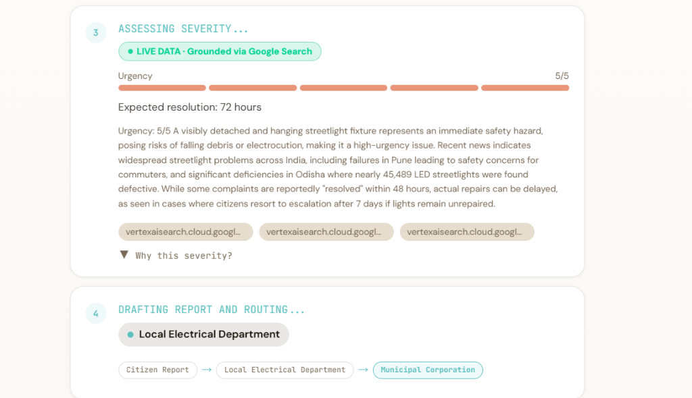

# CivicPulse — Community Hero · Vibe2Ship 2026

AI-powered civic issue reporting for Indian communities. Upload a photo, and a 4-step Gemini agent chain analyzes, checks duplicates, assesses severity with live grounding, and drafts a routed municipal report — in under 30 seconds.

## Live Demo

**[civicpulse-262178490437.asia-south1.run.app](https://civicpulse-262178490437.asia-south1.run.app/)**

Deployed on *Google Cloud Run*.

## GitHub

[github.com/cyber-rifle/vibe2skill-hackathon](https://github.com/cyber-rifle/vibe2skill-hackathon)

## Stack

Next.js 16 · TypeScript (strict) · Tailwind v4 · Gemini 2.5 Flash · Google Search Grounding · React-Leaflet · Framer Motion

## Features

- *4-step sequential Gemini agent chain* — classify → duplicate check → severity assessment → department routing, with a live streaming reveal of each step's reasoning
- *Gemini bounding box overlay* — AI identifies and draws the exact issue location within the photo frame
- *Google Search grounding* on severity assessment, with a "LIVE DATA · Grounded via Google Search" badge and cited sources when available
- *Real-time token streaming* (generateContentStream) on the severity step, with automatic fallback to non-streaming if the connection drops
- *Human-in-the-loop confirmation panel* — nothing is submitted without explicit user review
- *Live community map* with severity-coded markers, heatmap layer, and marker clustering for dense areas
- *Voice input* for issue descriptions via the Web Speech API
- *Resolution time estimates* and department escalation chain visualization
- *Comment threads* on individual reports for community follow-up
- *City Command Center dashboard* — live aggregate stats, category breakdown, severity distribution, and issue pipeline tracking

## Google Technologies Used

- Gemini 2.5 Flash (multi-step agent chain, vision/bounding-box detection)
- Google Search Grounding (real-world severity context)
- Google Cloud Run (deployment)
- Google AI Studio (prompt prototyping during development)

## Architecture Note

The app runs on a single shared deployment link with no per-user authentication — consistent with the hackathon's solo, anonymous-reporting use case. Dashboard and impact stats reflect activity across all visitors to the live URL.

## Developer

Mohammed Muzammil · Vibe2Ship 2026 · Community Hero track
